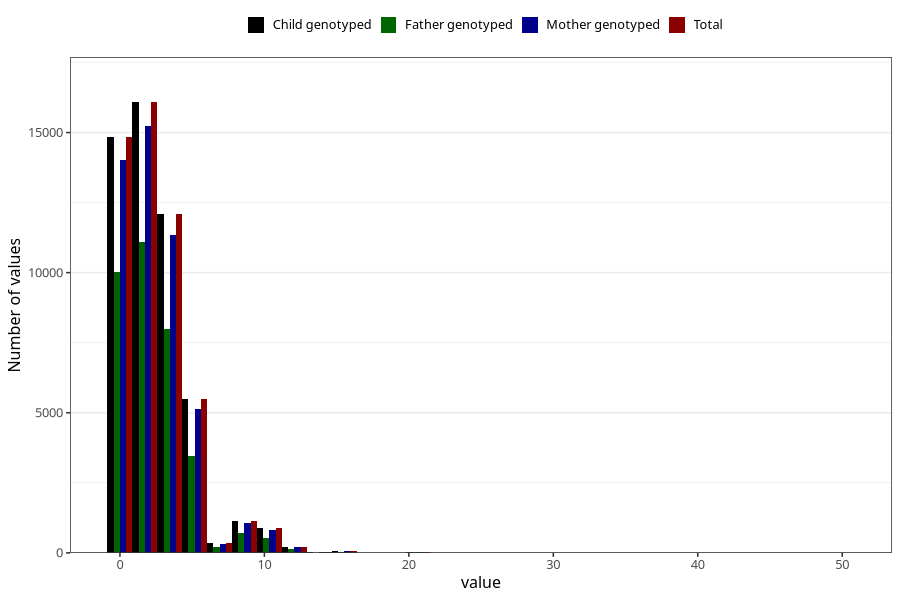

# coffee_before_filter
Variable mapping to `AA1377` in `Skjema1_v12`.
- Number of values:

| Value | Total | Child genotyped | Mother genotyped | Father genotyped |
| ----- | ----- | --------------- | ---------------- | ---------------- |
| Missing | 29765 | 29765 | 27917 | 19041 |
| Non-missing | 51258 | 51258 | 48312 | 34270 |
| Consumption have been reported by a mark but no amount given | 2 | 2 | 2 |1 |
| 25th percentile | 0 | 0 | 0 | 0 |
| 50th percentile | 2 | 2 | 2 | 2 |
| 75th percentile | 4 | 4 | 4 | 4 |
| Mean | 2.43352973310442 | 2.43352973310442 | 2.42428068722832 | 2.36630774169074 |
| Standard deviation | 2.51195769011868 | 2.51195769011868 | 2.50666180140299 | 2.44484351292455 |
| N | 51256 | 51256 | 48310 | 34269 |

