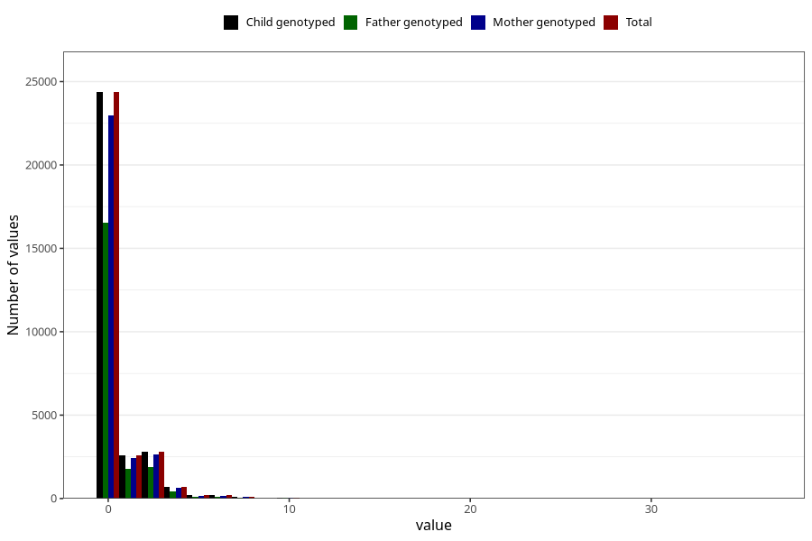

# coffee_before_instant
Variable mapping to `AA1380` in `Skjema1_v12`.
- Number of values:

| Value | Total | Child genotyped | Mother genotyped | Father genotyped |
| ----- | ----- | --------------- | ---------------- | ---------------- |
| Missing | 50043 | 50043 | 47029 | 32364 |
| Non-missing | 30980 | 30980 | 29200 | 20947 |
| Consumption have been reported by a mark but no amount given | 1 | 1 | 1 |0 |
| 0 | 24367 | 24367 | 22983 | 16535 |
| 1 | 2576 | 2576 | 2431 | 1754 |
| 2 | 2193 | 2193 | 2052 | 1459 |
| 3 | 605 | 605 | 578 | 407 |
| 4 | 686 | 686 | 640 | 452 |
| 5 | 194 | 194 | 181 | 117 |
| 6 | 191 | 191 | 178 | 113 |
| 7 | 22 | 22 | 20 | 15 |
| 8 | 81 | 81 | 75 | 53 |
| 9 | 2 | 2 | 2 | 2 |
| 10 | 47 | 47 | 45 | 30 |
| 12 | 7 | 7 | 7 | 4 |
| 14 | 2 | 2 | 2 | 2 |
| 15 | 3 | 3 | 2 | 3 |
| 16 | 1 | 1 | 1 | 1 |
| 24 | 1 | 1 | 1 | 0 |
| 36 | 1 | 1 | 1 | 0 |

