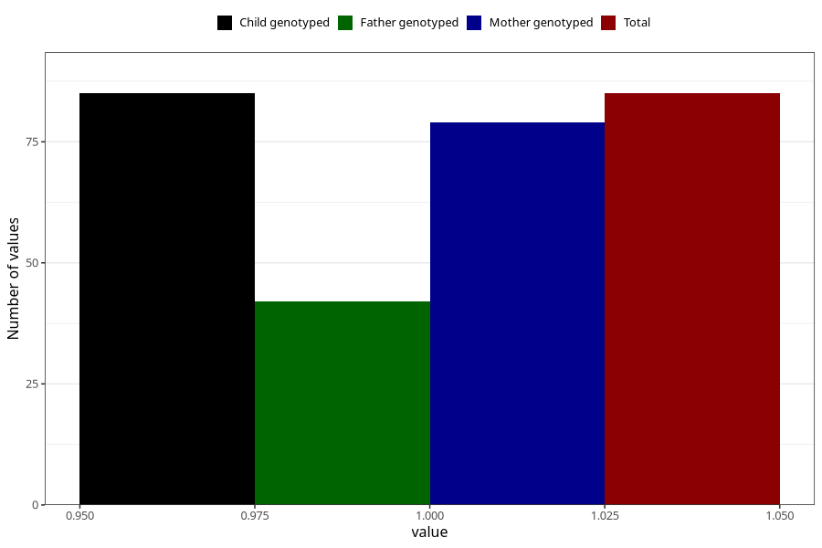

# coffee_boiled_decaf
Variable mapping to `AA1385` in `Skjema1_v12`.
- Number of values:

| Value | Total | Child genotyped | Mother genotyped | Father genotyped |
| ----- | ----- | --------------- | ---------------- | ---------------- |
| Missing | 80938 | 80938 | 76150 | 53269 |
| Non-missing | 85 | 85 | 79 | 42 |
| 1 | 85 | 85 | 79 | 42 |

