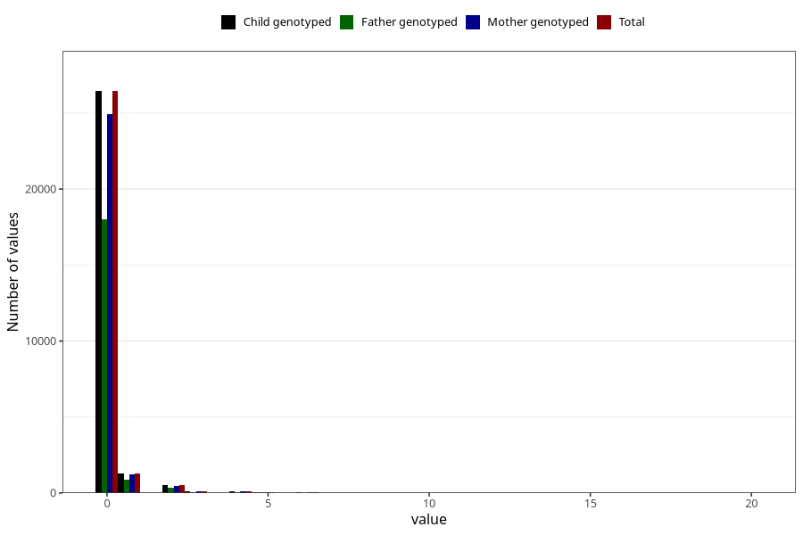

# coffee_during_boiled
Variable mapping to `AA1384` in `Skjema1_v12`.
- Number of values:

| Value | Total | Child genotyped | Mother genotyped | Father genotyped |
| ----- | ----- | --------------- | ---------------- | ---------------- |
| Missing | 52461 | 52461 | 49298 | 33977 |
| Non-missing | 28562 | 28562 | 26931 | 19334 |
| Consumption have been reported by a mark but no amount given | 2 | 2 | 2 |0 |
| 0 | 26447 | 26447 | 24942 | 17990 |
| 1 | 1281 | 1281 | 1216 | 850 |
| 2 | 520 | 520 | 491 | 316 |
| 3 | 112 | 112 | 99 | 67 |
| 4 | 97 | 97 | 91 | 55 |
| 5 | 42 | 42 | 34 | 24 |
| 6 | 28 | 28 | 28 | 20 |
| 7 | 7 | 7 | 6 | 2 |
| 8 | 8 | 8 | 7 | 2 |
| 10 | 13 | 13 | 11 | 6 |
| 12 | 2 | 2 | 1 | 0 |
| 15 | 1 | 1 | 1 | 1 |
| 16 | 1 | 1 | 1 | 1 |
| 20 | 1 | 1 | 1 | 0 |

