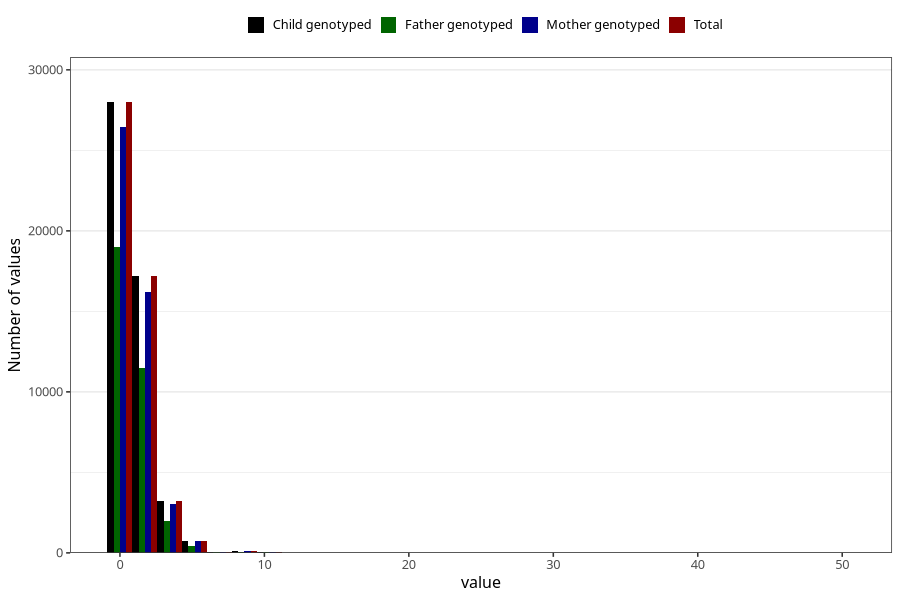

# coffee_during_filter
Variable mapping to `AA1378` in `Skjema1_v12`.
- Number of values:

| Value | Total | Child genotyped | Mother genotyped | Father genotyped |
| ----- | ----- | --------------- | ---------------- | ---------------- |
| Missing | 31569 | 31569 | 29639 | 20277 |
| Non-missing | 49454 | 49454 | 46590 | 33034 |
| 0 | 27991 | 27991 | 26424 | 19014 |
| 1 | 10415 | 10415 | 9825 | 7106 |
| 2 | 6792 | 6792 | 6352 | 4399 |
| 3 | 1835 | 1835 | 1702 | 1086 |
| 4 | 1408 | 1408 | 1334 | 883 |
| 5 | 420 | 420 | 395 | 242 |
| 6 | 341 | 341 | 319 | 175 |
| 7 | 38 | 38 | 37 | 25 |
| 8 | 103 | 103 | 98 | 56 |
| 9 | 5 | 5 | 4 | 2 |
| 10 | 74 | 74 | 70 | 33 |
| 12 | 20 | 20 | 19 | 7 |
| 14 | 1 | 1 | 1 | 1 |
| 15 | 1 | 1 | 1 | 1 |
| 16 | 2 | 2 | 1 | 0 |
| 20 | 6 | 6 | 6 | 3 |
| 25 | 1 | 1 | 1 | 1 |
| 50 | 1 | 1 | 1 | 0 |

