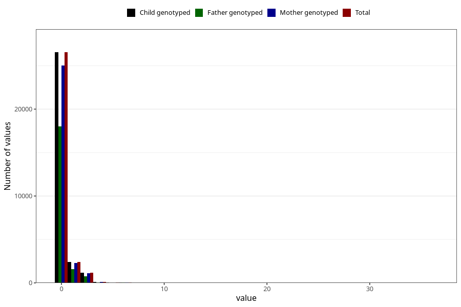

# coffee_during_instant
Variable mapping to `AA1381` in `Skjema1_v12`.
- Number of values:

| Value | Total | Child genotyped | Mother genotyped | Father genotyped |
| ----- | ----- | --------------- | ---------------- | ---------------- |
| Missing | 50667 | 50667 | 47619 | 32799 |
| Non-missing | 30356 | 30356 | 28610 | 20512 |
| 0 | 26544 | 26544 | 25016 | 18025 |
| 1 | 2419 | 2419 | 2286 | 1601 |
| 2 | 1018 | 1018 | 951 | 658 |
| 3 | 145 | 145 | 140 | 89 |
| 4 | 135 | 135 | 128 | 80 |
| 5 | 24 | 24 | 21 | 18 |
| 6 | 46 | 46 | 44 | 28 |
| 7 | 6 | 6 | 6 | 4 |
| 8 | 8 | 8 | 8 | 4 |
| 10 | 8 | 8 | 7 | 4 |
| 14 | 1 | 1 | 1 | 1 |
| 24 | 1 | 1 | 1 | 0 |
| 36 | 1 | 1 | 1 | 0 |

