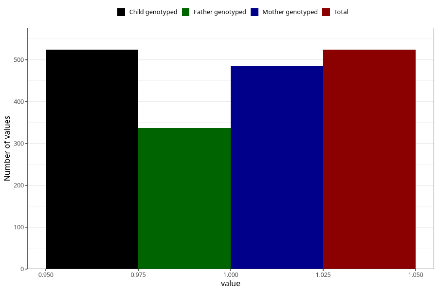

# coffee_filter_decaf
Variable mapping to `AA1379` in `Skjema1_v12`.
- Number of values:

| Value | Total | Child genotyped | Mother genotyped | Father genotyped |
| ----- | ----- | --------------- | ---------------- | ---------------- |
| Missing | 80499 | 80499 | 75744 | 52974 |
| Non-missing | 524 | 524 | 485 | 337 |
| 1 | 524 | 524 | 485 | 337 |

