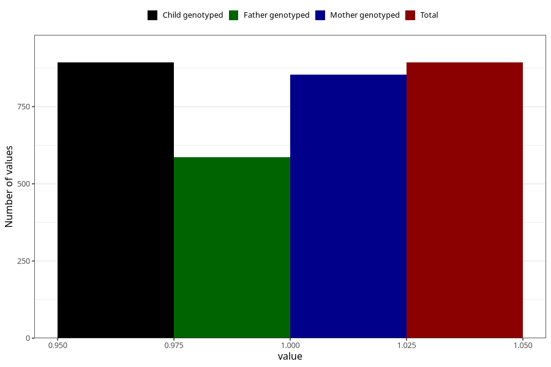

# coffee_instant_decaf
Variable mapping to `AA1382` in `Skjema1_v12`.
- Number of values:

| Value | Total | Child genotyped | Mother genotyped | Father genotyped |
| ----- | ----- | --------------- | ---------------- | ---------------- |
| Missing | 80130 | 80130 | 75376 | 52725 |
| Non-missing | 893 | 893 | 853 | 586 |
| 1 | 893 | 893 | 853 | 586 |

