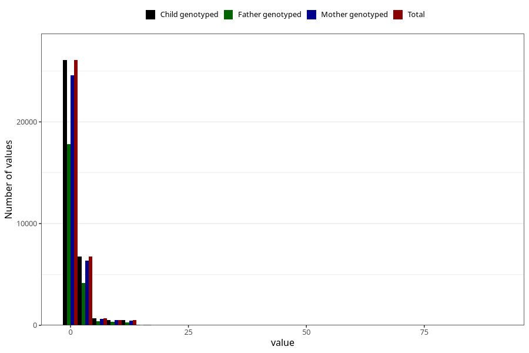

# coke_before
Variable mapping to `AA1392` in `Skjema1_v12`.
- Number of values:

| Value | Total | Child genotyped | Mother genotyped | Father genotyped |
| ----- | ----- | --------------- | ---------------- | ---------------- |
| Missing | 46408 | 46408 | 43659 | 30236 |
| Non-missing | 34615 | 34615 | 32570 | 23075 |
| Consumption have been reported by a mark but no amount given | 5 | 5 | 5 |2 |
| 25th percentile | 0 | 0 | 0 | 0 |
| 50th percentile | 0 | 0 | 0 | 0 |
| 75th percentile | 1 | 1 | 1 | 1 |
| Mean | 1.19245882692863 | 1.19245882692863 | 1.18357131890066 | 1.10596801456248 |
| Standard deviation | 2.33553808031188 | 2.33553808031188 | 2.32572526179577 | 2.28353712277814 |
| N | 34610 | 34610 | 32565 | 23073 |

