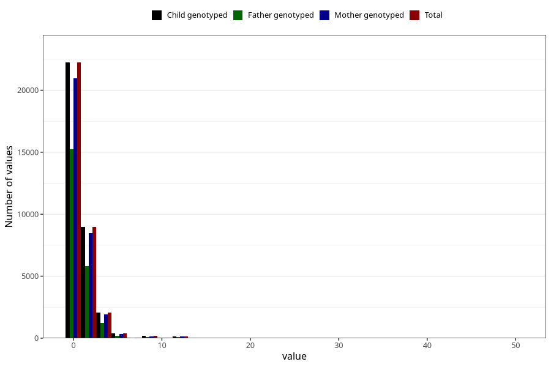

# coke_during
Variable mapping to `AA1393` in `Skjema1_v12`.
- Number of values:

| Value | Total | Child genotyped | Mother genotyped | Father genotyped |
| ----- | ----- | --------------- | ---------------- | ---------------- |
| Missing | 46939 | 46939 | 44115 | 30547 |
| Non-missing | 34084 | 34084 | 32114 | 22764 |
| Consumption have been reported by a mark but no amount given | 3 | 3 | 3 |1 |
| 25th percentile | 0 | 0 | 0 | 0 |
| 50th percentile | 0 | 0 | 0 | 0 |
| 75th percentile | 1 | 1 | 1 | 1 |
| Mean | 0.763181831519028 | 0.763181831519028 | 0.75880539379029 | 0.703685805913105 |
| Standard deviation | 1.64425340666288 | 1.64425340666288 | 1.63939119218076 | 1.59223304782648 |
| N | 34081 | 34081 | 32111 | 22763 |

