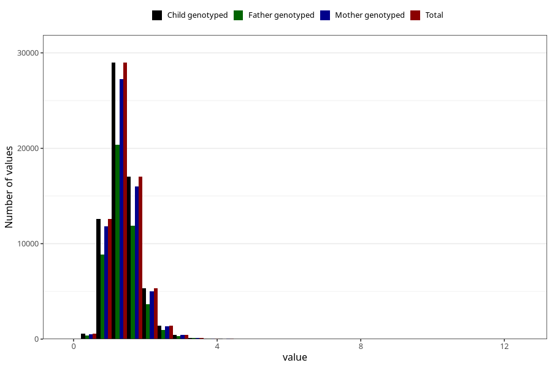

# copper
Variable mapping to `KOPPER` in `Skjema2_beregning_CDW_v12`.
- Number of values:

| Value | Total | Child genotyped | Mother genotyped | Father genotyped |
| ----- | ----- | --------------- | ---------------- | ---------------- |
| Missing | 14322 | 14322 | 13583 | 6707 |
| Non-missing | 66701 | 66701 | 62646 | 46604 |
| 25th percentile | 1.12 | 1.12 | 1.12 | 1.12 |
| 50th percentile | 1.35 | 1.35 | 1.35 | 1.35 |
| 75th percentile | 1.63 | 1.63 | 1.63 | 1.62 |
| Mean | 1.41621160102547 | 1.41621160102547 | 1.41560578488651 | 1.40853231482276 |
| Standard deviation | 0.463297156277091 | 0.463297156277091 | 0.462154216945447 | 0.450120465159323 |
| N | 66701 | 66701 | 62646 | 46604 |

