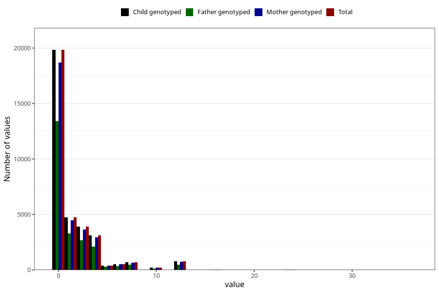

# diet_coke_before
Variable mapping to `AA1398` in `Skjema1_v12`.
- Number of values:

| Value | Total | Child genotyped | Mother genotyped | Father genotyped |
| ----- | ----- | --------------- | ---------------- | ---------------- |
| Missing | 46610 | 46610 | 43831 | 29976 |
| Non-missing | 34413 | 34413 | 32398 | 23335 |
| Consumption have been reported by a mark but no amount given | 4 | 4 | 3 |2 |
| 25th percentile | 0 | 0 | 0 | 0 |
| 50th percentile | 0 | 0 | 0 | 0 |
| 75th percentile | 2 | 2 | 2 | 2 |
| Mean | 1.477694789154 | 1.477694789154 | 1.47831455471523 | 1.44777782539751 |
| Standard deviation | 2.77152086600118 | 2.77152086600118 | 2.7714461252564 | 2.68507964886286 |
| N | 34409 | 34409 | 32395 | 23333 |

