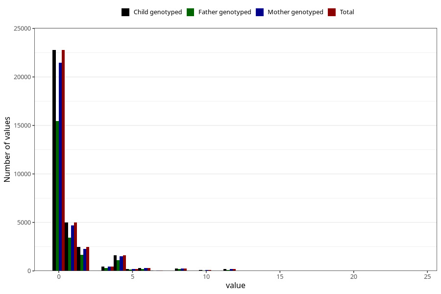

# diet_coke_during
Variable mapping to `AA1399` in `Skjema1_v12`.
- Number of values:

| Value | Total | Child genotyped | Mother genotyped | Father genotyped |
| ----- | ----- | --------------- | ---------------- | ---------------- |
| Missing | 47585 | 47585 | 44760 | 30616 |
| Non-missing | 33438 | 33438 | 31469 | 22695 |
| Consumption have been reported by a mark but no amount given | 3 | 3 | 2 |1 |
| 25th percentile | 0 | 0 | 0 | 0 |
| 50th percentile | 0 | 0 | 0 | 0 |
| 75th percentile | 1 | 1 | 1 | 1 |
| Mean | 0.807477194556602 | 0.807477194556602 | 0.804239361871167 | 0.784656737463647 |
| Standard deviation | 1.81559819417642 | 1.81559819417642 | 1.81061752060492 | 1.74810165749191 |
| N | 33435 | 33435 | 31467 | 22694 |

