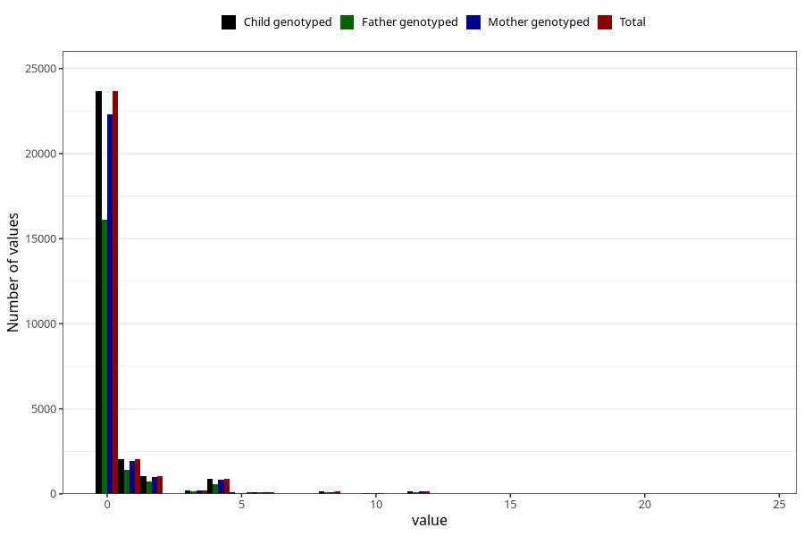

# diet_soda_before
Variable mapping to `AA1401` in `Skjema1_v12`.
- Number of values:

| Value | Total | Child genotyped | Mother genotyped | Father genotyped |
| ----- | ----- | --------------- | ---------------- | ---------------- |
| Missing | 52653 | 52653 | 49506 | 34010 |
| Non-missing | 28370 | 28370 | 26723 | 19301 |
| Consumption have been reported by a mark but no amount given | 3 | 3 | 3 |2 |
| 0 | 23660 | 23660 | 22301 | 16086 |
| 1 | 2035 | 2035 | 1913 | 1431 |
| 2 | 1048 | 1048 | 984 | 722 |
| 3 | 187 | 187 | 177 | 129 |
| 4 | 866 | 866 | 822 | 574 |
| 5 | 80 | 80 | 70 | 41 |
| 6 | 107 | 107 | 102 | 77 |
| 7 | 15 | 15 | 14 | 10 |
| 8 | 134 | 134 | 124 | 81 |
| 9 | 5 | 5 | 5 | 5 |
| 10 | 54 | 54 | 50 | 27 |
| 12 | 155 | 155 | 139 | 99 |
| 14 | 2 | 2 | 2 | 2 |
| 15 | 2 | 2 | 1 | 1 |
| 16 | 7 | 7 | 7 | 5 |
| 18 | 4 | 4 | 4 | 3 |
| 20 | 2 | 2 | 1 | 2 |
| 24 | 4 | 4 | 4 | 4 |

