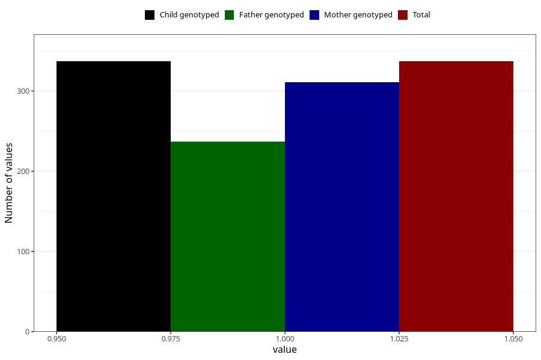

# diet_soda_decaf
Variable mapping to `AA1403` in `Skjema1_v12`.
- Number of values:

| Value | Total | Child genotyped | Mother genotyped | Father genotyped |
| ----- | ----- | --------------- | ---------------- | ---------------- |
| Missing | 80686 | 80686 | 75918 | 53074 |
| Non-missing | 337 | 337 | 311 | 237 |
| 1 | 337 | 337 | 311 | 237 |

