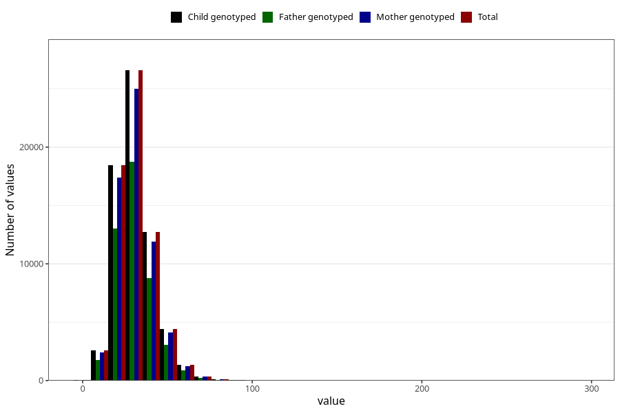

# dietary_fiber
Variable mapping to `FIBER` in `Skjema2_beregning_CDW_v12`.
- Number of values:

| Value | Total | Child genotyped | Mother genotyped | Father genotyped |
| ----- | ----- | --------------- | ---------------- | ---------------- |
| Missing | 14322 | 14322 | 13583 | 6707 |
| Non-missing | 66701 | 66701 | 62646 | 46604 |
| 25th percentile | 23.62 | 23.62 | 23.62 | 23.59 |
| 50th percentile | 29.5 | 29.5 | 29.49 | 29.39 |
| 75th percentile | 36.65 | 36.65 | 36.64 | 36.46 |
| Mean | 31.0857597337371 | 31.0857597337371 | 31.0788873990359 | 30.9285870311561 |
| Standard deviation | 11.4294520302824 | 11.4294520302824 | 11.4051430021732 | 11.1872257278079 |
| N | 66701 | 66701 | 62646 | 46604 |

