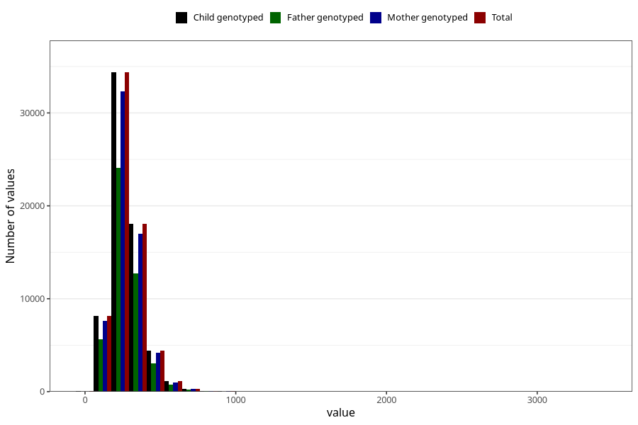

# folate
Variable mapping to `FOLAT` in `Skjema2_beregning_CDW_v12`.
- Number of values:

| Value | Total | Child genotyped | Mother genotyped | Father genotyped |
| ----- | ----- | --------------- | ---------------- | ---------------- |
| Missing | 14322 | 14322 | 13583 | 6707 |
| Non-missing | 66701 | 66701 | 62646 | 46604 |
| 25th percentile | 208.18 | 208.18 | 208.23 | 208.085 |
| 50th percentile | 261.22 | 261.22 | 261.115 | 260.725 |
| 75th percentile | 326.38 | 326.38 | 326.01 | 325.5125 |
| Mean | 278.090325482377 | 278.090325482377 | 277.837021038853 | 276.771858638743 |
| Standard deviation | 109.120190903485 | 109.120190903485 | 108.473936577312 | 106.035932618112 |
| N | 66701 | 66701 | 62646 | 46604 |

