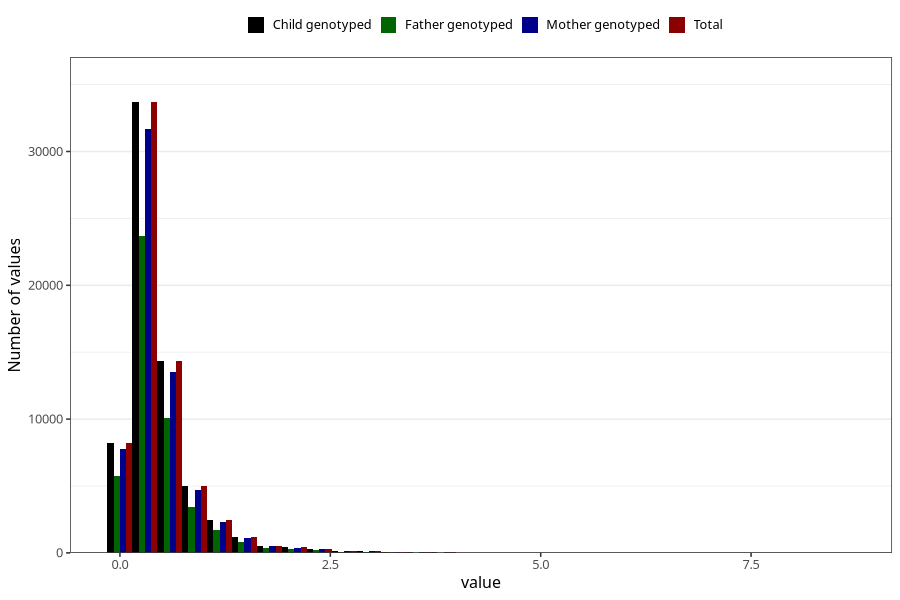

# food_LCn3_g_day
Variable mapping to `f_sum_LCn3` in `Skjema2_beregning_CDW_foody_fatty_acid_and_iodine_v12`.
- Number of values:

| Value | Total | Child genotyped | Mother genotyped | Father genotyped |
| ----- | ----- | --------------- | ---------------- | ---------------- |
| Missing | 14322 | 14322 | 13583 | 6707 |
| Non-missing | 66701 | 66701 | 62646 | 46604 |
| 25th percentile | 0.2219 | 0.2219 | 0.2219 | 0.2228 |
| 50th percentile | 0.3557 | 0.3557 | 0.3557 | 0.3562 |
| 75th percentile | 0.5671 | 0.5671 | 0.5664 | 0.5628 |
| Mean | 0.475998893569812 | 0.475998893569812 | 0.475633258308591 | 0.471916934168741 |
| Standard deviation | 0.442349365916593 | 0.442349365916593 | 0.441478749870499 | 0.43343512793646 |
| N | 66701 | 66701 | 62646 | 46604 |

