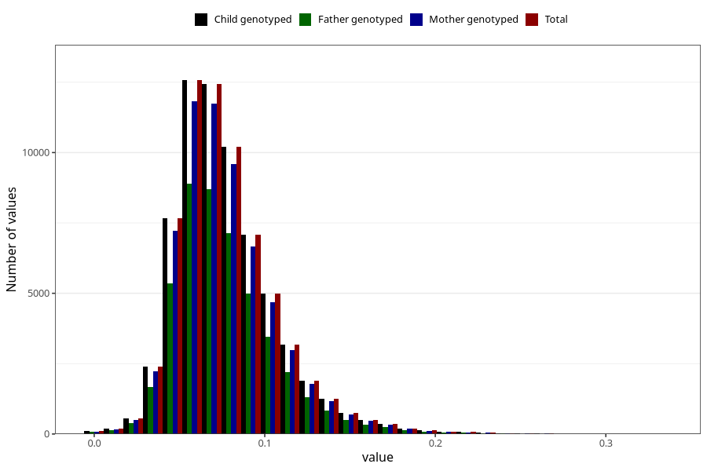

# food_aa_g_day
Variable mapping to `f_aa` in `Skjema2_beregning_CDW_foody_fatty_acid_and_iodine_v12`.
- Number of values:

| Value | Total | Child genotyped | Mother genotyped | Father genotyped |
| ----- | ----- | --------------- | ---------------- | ---------------- |
| Missing | 14322 | 14322 | 13583 | 6707 |
| Non-missing | 66701 | 66701 | 62646 | 46604 |
| 25th percentile | 0.0571 | 0.0571 | 0.0571 | 0.057 |
| 50th percentile | 0.0721 | 0.0721 | 0.0721 | 0.0719 |
| 75th percentile | 0.0919 | 0.0919 | 0.0919 | 0.0916 |
| Mean | 0.0773474025876674 | 0.0773474025876674 | 0.0773421862529132 | 0.0770810123594541 |
| Standard deviation | 0.0297385668914475 | 0.0297385668914475 | 0.0296792626185709 | 0.0293639691405367 |
| N | 66701 | 66701 | 62646 | 46604 |

