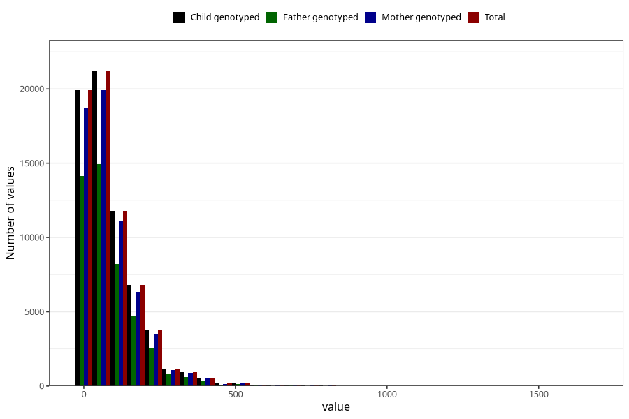

# food_caffeine_total
Variable mapping to `f_caff_tot` in `Skjema2_beregning_CDW_caffeine_food_and_supplements_v12`.
- Number of values:

| Value | Total | Child genotyped | Mother genotyped | Father genotyped |
| ----- | ----- | --------------- | ---------------- | ---------------- |
| Missing | 14322 | 14322 | 13583 | 6707 |
| Non-missing | 66701 | 66701 | 62646 | 46604 |
| 25th percentile | 23.2665 | 23.2665 | 23.26395 | 22.8388 |
| 50th percentile | 59.2501 | 59.2501 | 59.1017 | 57.8248 |
| 75th percentile | 123.5011 | 123.5011 | 123.4065 | 121.076725 |
| Mean | 89.5278692223505 | 89.5278692223505 | 89.3405033138588 | 87.1962507724659 |
| Standard deviation | 94.1603531011716 | 94.1603531011716 | 93.8521991103305 | 90.7105229379615 |
| N | 66701 | 66701 | 62646 | 46604 |

