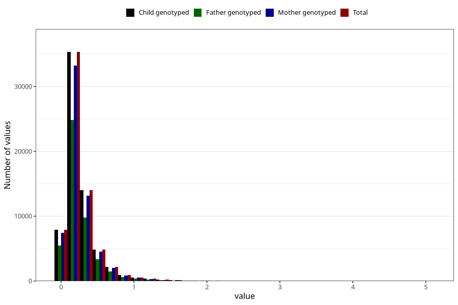

# food_dha_g_day
Variable mapping to `f_dha` in `Skjema2_beregning_CDW_foody_fatty_acid_and_iodine_v12`.
- Number of values:

| Value | Total | Child genotyped | Mother genotyped | Father genotyped |
| ----- | ----- | --------------- | ---------------- | ---------------- |
| Missing | 14322 | 14322 | 13583 | 6707 |
| Non-missing | 66701 | 66701 | 62646 | 46604 |
| 25th percentile | 0.1289 | 0.1289 | 0.1289 | 0.1293 |
| 50th percentile | 0.2025 | 0.2025 | 0.2025 | 0.2025 |
| 75th percentile | 0.3199 | 0.3199 | 0.3195 | 0.317 |
| Mean | 0.267369595658236 | 0.267369595658236 | 0.267163363981739 | 0.264882589477298 |
| Standard deviation | 0.241299356378971 | 0.241299356378971 | 0.240804417951149 | 0.23620844408078 |
| N | 66701 | 66701 | 62646 | 46604 |

