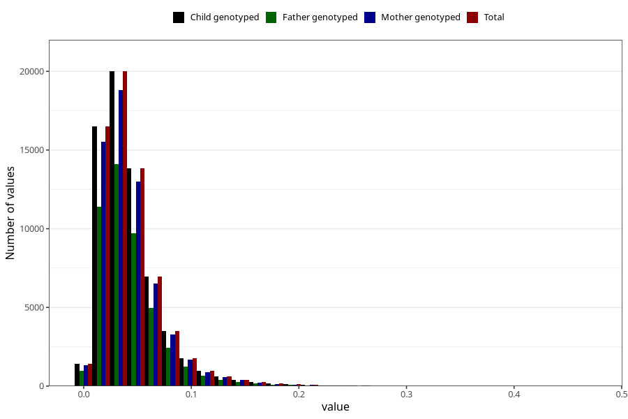

# food_dpa_g_day
Variable mapping to `f_dpa` in `Skjema2_beregning_CDW_foody_fatty_acid_and_iodine_v12`.
- Number of values:

| Value | Total | Child genotyped | Mother genotyped | Father genotyped |
| ----- | ----- | --------------- | ---------------- | ---------------- |
| Missing | 14322 | 14322 | 13583 | 6707 |
| Non-missing | 66701 | 66701 | 62646 | 46604 |
| 25th percentile | 0.0233 | 0.0233 | 0.0233 | 0.0234 |
| 50th percentile | 0.0365 | 0.0365 | 0.0365 | 0.0366 |
| 75th percentile | 0.0539 | 0.0539 | 0.0538 | 0.0537 |
| Mean | 0.0430789343488104 | 0.0430789343488104 | 0.0430634485841075 | 0.0428921165565188 |
| Standard deviation | 0.0303443808329604 | 0.0303443808329604 | 0.0303200439761934 | 0.0297355901364888 |
| N | 66701 | 66701 | 62646 | 46604 |

