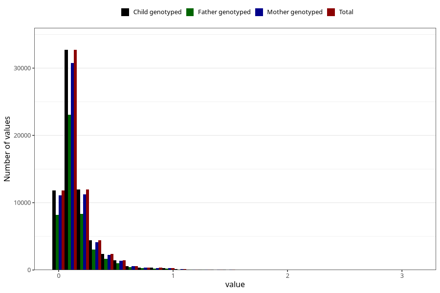

# food_epa_g_day
Variable mapping to `f_epa` in `Skjema2_beregning_CDW_foody_fatty_acid_and_iodine_v12`.
- Number of values:

| Value | Total | Child genotyped | Mother genotyped | Father genotyped |
| ----- | ----- | --------------- | ---------------- | ---------------- |
| Missing | 14322 | 14322 | 13583 | 6707 |
| Non-missing | 66701 | 66701 | 62646 | 46604 |
| 25th percentile | 0.0682 | 0.0682 | 0.0683 | 0.0686 |
| 50th percentile | 0.1159 | 0.1159 | 0.1159 | 0.116 |
| 75th percentile | 0.194 | 0.194 | 0.1938 | 0.192 |
| Mean | 0.165550363562765 | 0.165550363562765 | 0.165406445742745 | 0.164142228134924 |
| Standard deviation | 0.175091551218216 | 0.175091551218216 | 0.174712457550928 | 0.171779805621998 |
| N | 66701 | 66701 | 62646 | 46604 |

