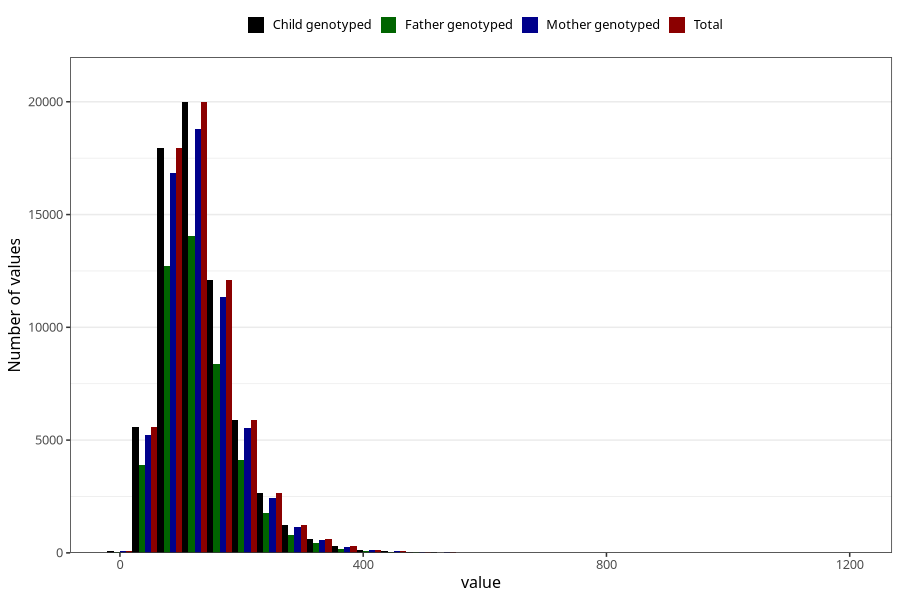

# food_iodine_mcg_day
Variable mapping to `f_jod` in `Skjema2_beregning_CDW_foody_fatty_acid_and_iodine_v12`.
- Number of values:

| Value | Total | Child genotyped | Mother genotyped | Father genotyped |
| ----- | ----- | --------------- | ---------------- | ---------------- |
| Missing | 14322 | 14322 | 13583 | 6707 |
| Non-missing | 66701 | 66701 | 62646 | 46604 |
| 25th percentile | 88.5342 | 88.5342 | 88.5246 | 88.157325 |
| 50th percentile | 121.2502 | 121.2502 | 121.2691 | 120.40235 |
| 75th percentile | 161.6842 | 161.6842 | 161.4276 | 160.37545 |
| Mean | 132.416120585898 | 132.416120585898 | 132.288678469495 | 131.176124667411 |
| Standard deviation | 65.8101597101616 | 65.8101597101616 | 65.7243524777562 | 64.3566439972037 |
| N | 66701 | 66701 | 62646 | 46604 |

