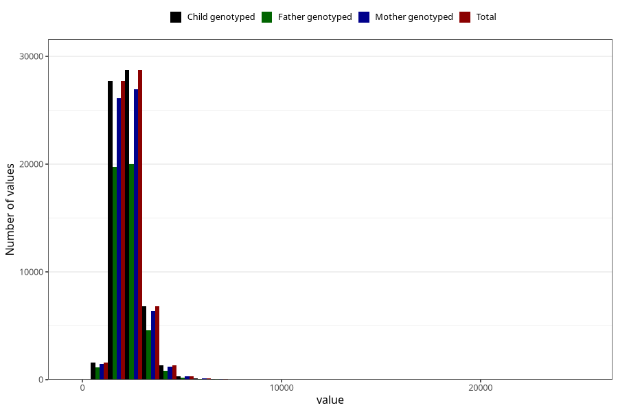

# food_kcal_day
Variable mapping to `f_kcal` in `Skjema2_beregning_CDW_caffeine_food_and_supplements_v12`.
- Number of values:

| Value | Total | Child genotyped | Mother genotyped | Father genotyped |
| ----- | ----- | --------------- | ---------------- | ---------------- |
| Missing | 14322 | 14322 | 13583 | 6707 |
| Non-missing | 66701 | 66701 | 62646 | 46604 |
| 25th percentile | 1876.48 | 1876.48 | 1875.56 | 1868.065 |
| 50th percentile | 2229.06 | 2229.06 | 2227.75 | 2215.005 |
| 75th percentile | 2655.69 | 2655.69 | 2653.6725 | 2635.4325 |
| Mean | 2330.4883297102 | 2330.4883297102 | 2328.53862177952 | 2310.29067590765 |
| Standard deviation | 729.827486029686 | 729.827486029686 | 726.814205736585 | 700.498172691907 |
| N | 66701 | 66701 | 62646 | 46604 |

