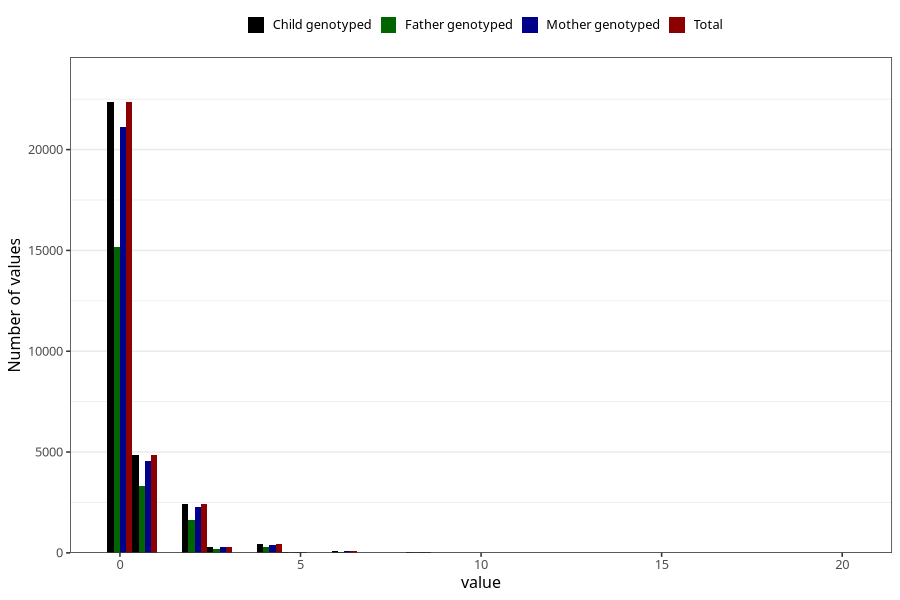

# herbal_tea_during
Variable mapping to `AA1390` in `Skjema1_v12`.
- Number of values:

| Value | Total | Child genotyped | Mother genotyped | Father genotyped |
| ----- | ----- | --------------- | ---------------- | ---------------- |
| Missing | 50434 | 50434 | 47367 | 32602 |
| Non-missing | 30589 | 30589 | 28862 | 20709 |
| 0 | 22351 | 22351 | 21103 | 15168 |
| 1 | 4860 | 4860 | 4577 | 3327 |
| 2 | 2415 | 2415 | 2284 | 1616 |
| 3 | 310 | 310 | 286 | 184 |
| 4 | 429 | 429 | 405 | 288 |
| 5 | 50 | 50 | 46 | 30 |
| 6 | 109 | 109 | 101 | 58 |
| 7 | 9 | 9 | 9 | 4 |
| 8 | 36 | 36 | 33 | 21 |
| 10 | 11 | 11 | 10 | 6 |
| 12 | 7 | 7 | 6 | 6 |
| 16 | 1 | 1 | 1 | 1 |
| 20 | 1 | 1 | 1 | 0 |

