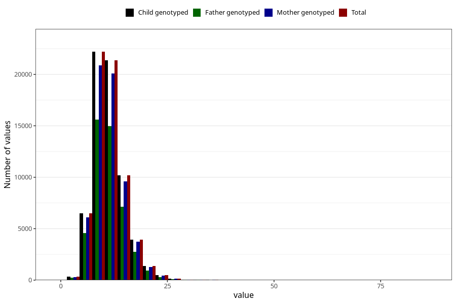

# iron
Variable mapping to `JERN` in `Skjema2_beregning_CDW_v12`.
- Number of values:

| Value | Total | Child genotyped | Mother genotyped | Father genotyped |
| ----- | ----- | --------------- | ---------------- | ---------------- |
| Missing | 14322 | 14322 | 13583 | 6707 |
| Non-missing | 66701 | 66701 | 62646 | 46604 |
| 25th percentile | 8.92 | 8.92 | 8.92 | 8.91 |
| 50th percentile | 10.86 | 10.86 | 10.86 | 10.85 |
| 75th percentile | 13.25 | 13.25 | 13.24 | 13.21 |
| Mean | 11.3868336306802 | 11.3868336306802 | 11.3830645212783 | 11.344371298601 |
| Standard deviation | 3.731226228381 | 3.731226228381 | 3.72149805030423 | 3.64675894885335 |
| N | 66701 | 66701 | 62646 | 46604 |

