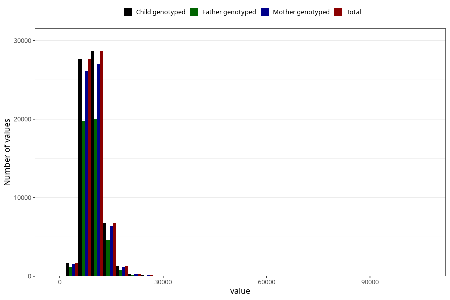

# kj
Variable mapping to `KJ` in `Skjema2_beregning_CDW_v12`.
- Number of values:

| Value | Total | Child genotyped | Mother genotyped | Father genotyped |
| ----- | ----- | --------------- | ---------------- | ---------------- |
| Missing | 14322 | 14322 | 13583 | 6707 |
| Non-missing | 66701 | 66701 | 62646 | 46604 |
| 25th percentile | 7890.37 | 7890.37 | 7887.225 | 7855.69 |
| 50th percentile | 9373.25 | 9373.25 | 9365.685 | 9316.98 |
| 75th percentile | 11167.72 | 11167.72 | 11157.905 | 11079.2775 |
| Mean | 9800.07048919806 | 9800.07048919806 | 9791.83630766529 | 9714.84532271908 |
| Standard deviation | 3073.38839084617 | 3073.38839084617 | 3060.61350877549 | 2948.12309917373 |
| N | 66701 | 66701 | 62646 | 46604 |

