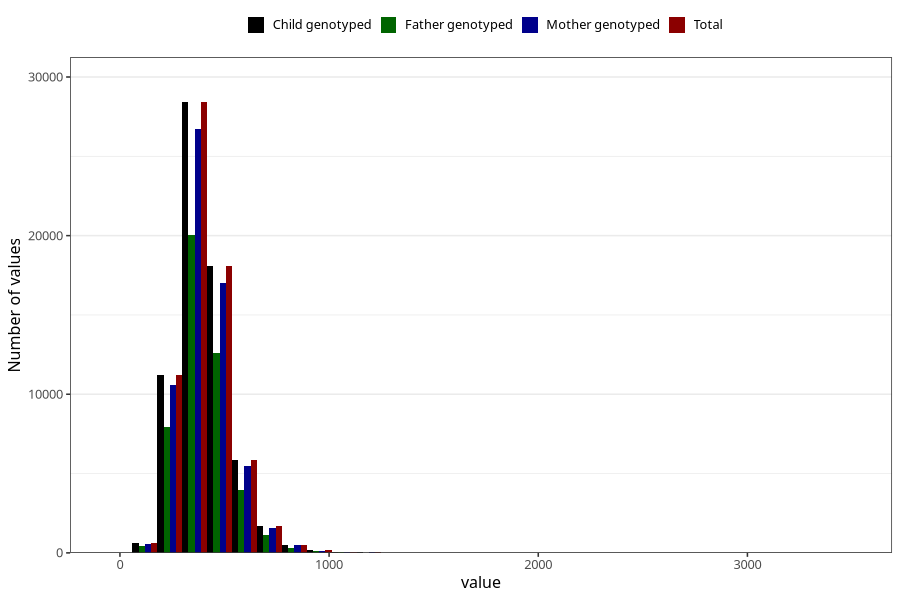

# magnesium
Variable mapping to `MAGNESIUM` in `Skjema2_beregning_CDW_v12`.
- Number of values:

| Value | Total | Child genotyped | Mother genotyped | Father genotyped |
| ----- | ----- | --------------- | ---------------- | ---------------- |
| Missing | 14322 | 14322 | 13583 | 6707 |
| Non-missing | 66701 | 66701 | 62646 | 46604 |
| 25th percentile | 320.64 | 320.64 | 320.575 | 319.7475 |
| 50th percentile | 387.92 | 387.92 | 387.76 | 386.18 |
| 75th percentile | 467.69 | 467.69 | 467.46 | 464.92 |
| Mean | 405.006260925623 | 405.006260925623 | 404.770630367462 | 402.550004935199 |
| Standard deviation | 131.351100100625 | 131.351100100625 | 131.018826528306 | 127.670790897721 |
| N | 66701 | 66701 | 62646 | 46604 |

