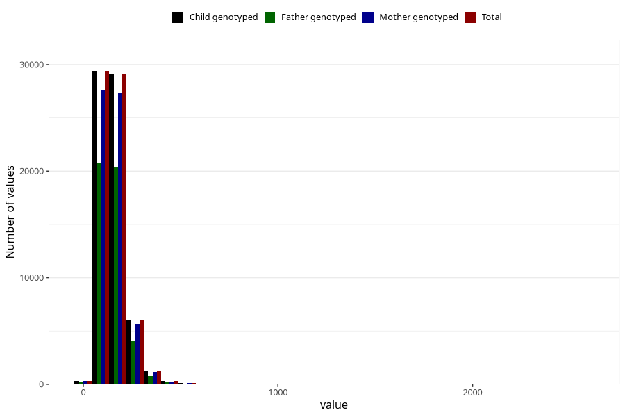

# mono_and_disaccharides
Variable mapping to `MONO_DISAKK` in `Skjema2_beregning_CDW_v12`.
- Number of values:

| Value | Total | Child genotyped | Mother genotyped | Father genotyped |
| ----- | ----- | --------------- | ---------------- | ---------------- |
| Missing | 14322 | 14322 | 13583 | 6707 |
| Non-missing | 66701 | 66701 | 62646 | 46604 |
| 25th percentile | 108.26 | 108.26 | 108.16 | 107.6375 |
| 50th percentile | 140.18 | 140.18 | 140.01 | 139.365 |
| 75th percentile | 181.18 | 181.18 | 180.99 | 179.71 |
| Mean | 152.878261345407 | 152.878261345407 | 152.650674424544 | 151.191016436357 |
| Standard deviation | 73.0569850944417 | 73.0569850944417 | 72.7675780400916 | 70.0083212712538 |
| N | 66701 | 66701 | 62646 | 46604 |

