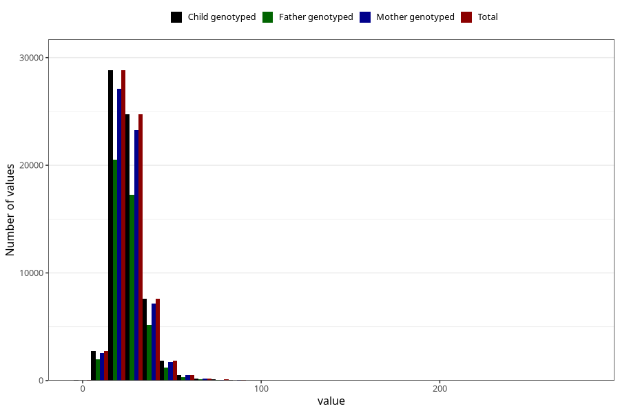

# monounsaturated_fatty_acids
Variable mapping to `ENUMETTET` in `Skjema2_beregning_CDW_v12`.
- Number of values:

| Value | Total | Child genotyped | Mother genotyped | Father genotyped |
| ----- | ----- | --------------- | ---------------- | ---------------- |
| Missing | 14322 | 14322 | 13583 | 6707 |
| Non-missing | 66701 | 66701 | 62646 | 46604 |
| 25th percentile | 19.98 | 19.98 | 19.98 | 19.86 |
| 50th percentile | 24.5 | 24.5 | 24.49 | 24.33 |
| 75th percentile | 30.14 | 30.14 | 30.11 | 29.91 |
| Mean | 26.0130995037556 | 26.0130995037556 | 25.995445519267 | 25.7777233713844 |
| Standard deviation | 9.4032425150174 | 9.4032425150174 | 9.40035161690451 | 9.10541537715901 |
| N | 66701 | 66701 | 62646 | 46604 |

