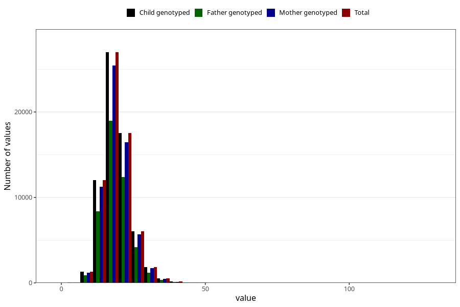

# niacin
Variable mapping to `NIACIN` in `Skjema2_beregning_CDW_v12`.
- Number of values:

| Value | Total | Child genotyped | Mother genotyped | Father genotyped |
| ----- | ----- | --------------- | ---------------- | ---------------- |
| Missing | 14322 | 14322 | 13583 | 6707 |
| Non-missing | 66701 | 66701 | 62646 | 46604 |
| 25th percentile | 16.08 | 16.08 | 16.08 | 16.09 |
| 50th percentile | 18.75 | 18.75 | 18.75 | 18.74 |
| 75th percentile | 21.83 | 21.83 | 21.82 | 21.79 |
| Mean | 19.3073289755776 | 19.3073289755776 | 19.3018800881142 | 19.2581969358853 |
| Standard deviation | 5.03945756006581 | 5.03945756006581 | 5.02531572267757 | 4.89976933145863 |
| N | 66701 | 66701 | 62646 | 46604 |

