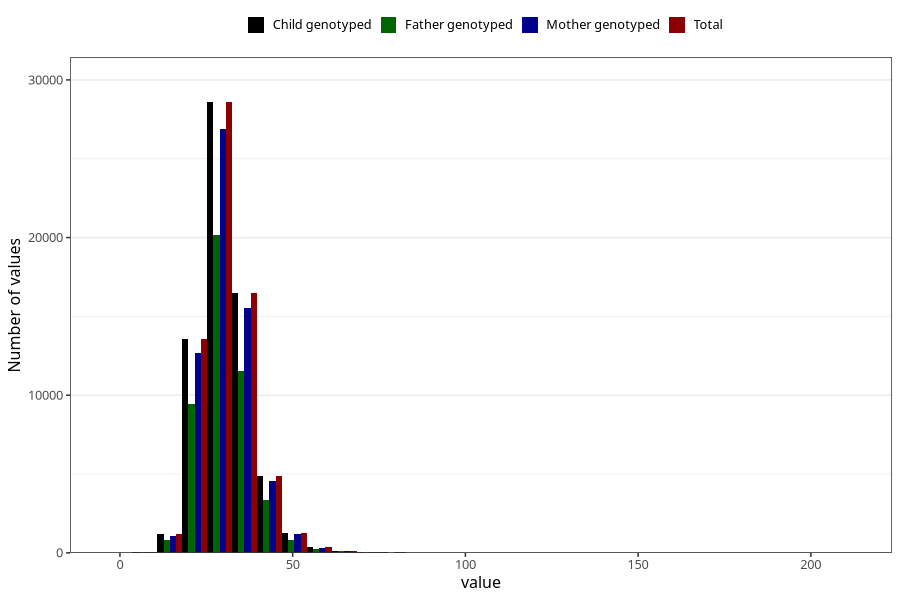

# niacin_eq
Variable mapping to `NIACIN_EQ` in `Skjema2_beregning_CDW_v12`.
- Number of values:

| Value | Total | Child genotyped | Mother genotyped | Father genotyped |
| ----- | ----- | --------------- | ---------------- | ---------------- |
| Missing | 14322 | 14322 | 13583 | 6707 |
| Non-missing | 66701 | 66701 | 62646 | 46604 |
| 25th percentile | 25.77 | 25.77 | 25.77 | 25.76 |
| 50th percentile | 29.86 | 29.86 | 29.85 | 29.78 |
| 75th percentile | 34.56 | 34.56 | 34.54 | 34.45 |
| Mean | 30.729364627217 | 30.729364627217 | 30.7149193883089 | 30.6196412325122 |
| Standard deviation | 7.81470614924157 | 7.81470614924157 | 7.78778196458362 | 7.59365087826359 |
| N | 66701 | 66701 | 62646 | 46604 |

