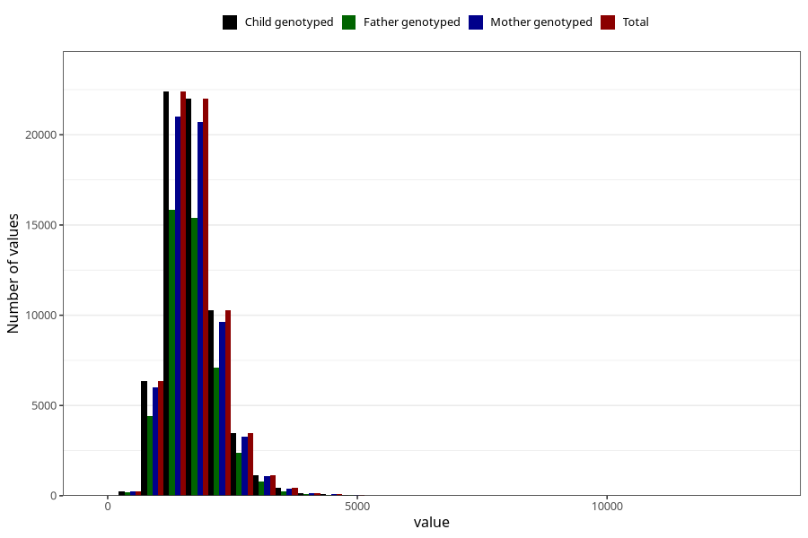

# phosphorus
Variable mapping to `FOSFOR` in `Skjema2_beregning_CDW_v12`.
- Number of values:

| Value | Total | Child genotyped | Mother genotyped | Father genotyped |
| ----- | ----- | --------------- | ---------------- | ---------------- |
| Missing | 14322 | 14322 | 13583 | 6707 |
| Non-missing | 66701 | 66701 | 62646 | 46604 |
| 25th percentile | 1350.49 | 1350.49 | 1350.17 | 1347.8875 |
| 50th percentile | 1640.48 | 1640.48 | 1640.815 | 1635.075 |
| 75th percentile | 1987.2 | 1987.2 | 1986.115 | 1978.2925 |
| Mean | 1715.80721293534 | 1715.80721293534 | 1714.68936755739 | 1707.21669062741 |
| Standard deviation | 559.890134199223 | 559.890134199223 | 558.465758592257 | 546.475639661184 |
| N | 66701 | 66701 | 62646 | 46604 |

