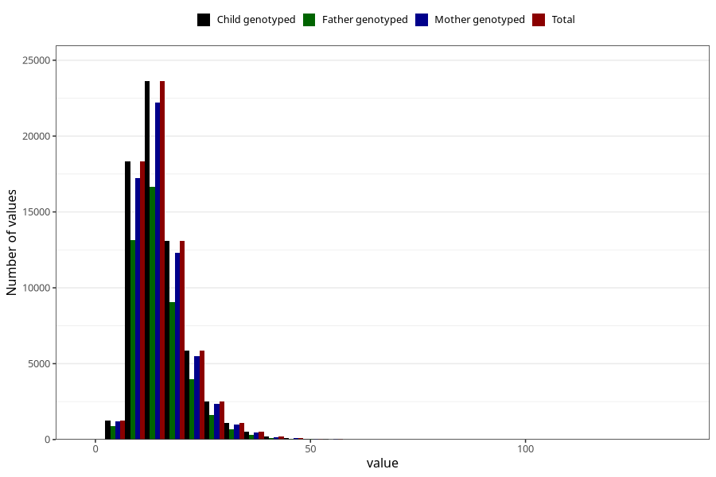

# polyunsaturated_fatty_acids
Variable mapping to `FLERUMETTET` in `Skjema2_beregning_CDW_v12`.
- Number of values:

| Value | Total | Child genotyped | Mother genotyped | Father genotyped |
| ----- | ----- | --------------- | ---------------- | ---------------- |
| Missing | 14322 | 14322 | 13583 | 6707 |
| Non-missing | 66701 | 66701 | 62646 | 46604 |
| 25th percentile | 11.01 | 11.01 | 11.01 | 10.93 |
| 50th percentile | 13.97 | 13.97 | 13.96 | 13.83 |
| 75th percentile | 18.08 | 18.08 | 18.06 | 17.87 |
| Mean | 15.2874824965143 | 15.2874824965143 | 15.2776704019411 | 15.1117659428375 |
| Standard deviation | 6.35909820304218 | 6.35909820304218 | 6.34355843764548 | 6.1721442781847 |
| N | 66701 | 66701 | 62646 | 46604 |

