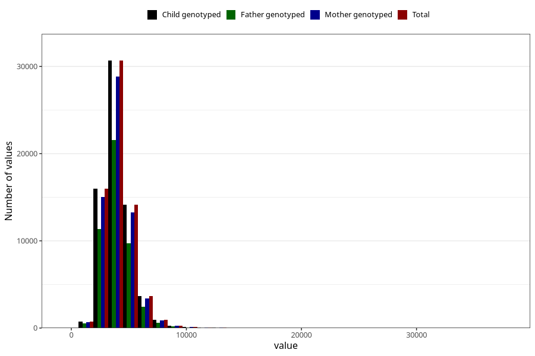

# potassium
Variable mapping to `KALIUM` in `Skjema2_beregning_CDW_v12`.
- Number of values:

| Value | Total | Child genotyped | Mother genotyped | Father genotyped |
| ----- | ----- | --------------- | ---------------- | ---------------- |
| Missing | 14322 | 14322 | 13583 | 6707 |
| Non-missing | 66701 | 66701 | 62646 | 46604 |
| 25th percentile | 3214.23 | 3214.23 | 3213.5175 | 3203.0525 |
| 50th percentile | 3870.7 | 3870.7 | 3869.725 | 3855.735 |
| 75th percentile | 4654.27 | 4654.27 | 4648.9875 | 4623.6175 |
| Mean | 4047.24482226653 | 4047.24482226653 | 4044.63631021933 | 4020.76755922238 |
| Standard deviation | 1313.8166033609 | 1313.8166033609 | 1309.484061374 | 1277.53131418423 |
| N | 66701 | 66701 | 62646 | 46604 |

