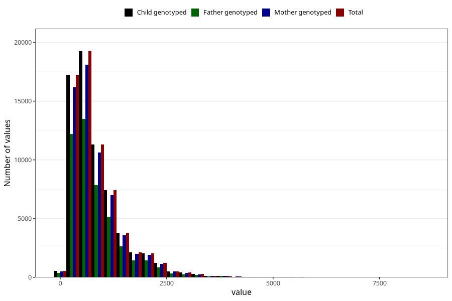

# retinol
Variable mapping to `RETINOL` in `Skjema2_beregning_CDW_v12`.
- Number of values:

| Value | Total | Child genotyped | Mother genotyped | Father genotyped |
| ----- | ----- | --------------- | ---------------- | ---------------- |
| Missing | 14322 | 14322 | 13583 | 6707 |
| Non-missing | 66701 | 66701 | 62646 | 46604 |
| 25th percentile | 426.11 | 426.11 | 426.29 | 423.7775 |
| 50th percentile | 663.26 | 663.26 | 663.25 | 656.375 |
| 75th percentile | 1084.25 | 1084.25 | 1083.9725 | 1077.4325 |
| Mean | 857.657704832012 | 857.657704832012 | 857.085480637231 | 851.776979014677 |
| Standard deviation | 648.694769017015 | 648.694769017015 | 647.416589930822 | 644.207952689539 |
| N | 66701 | 66701 | 62646 | 46604 |

