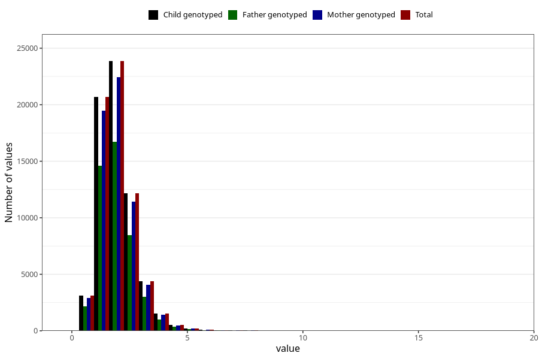

# riboflavin
Variable mapping to `RIBOFLAVIN` in `Skjema2_beregning_CDW_v12`.
- Number of values:

| Value | Total | Child genotyped | Mother genotyped | Father genotyped |
| ----- | ----- | --------------- | ---------------- | ---------------- |
| Missing | 14322 | 14322 | 13583 | 6707 |
| Non-missing | 66701 | 66701 | 62646 | 46604 |
| 25th percentile | 1.44 | 1.44 | 1.44 | 1.44 |
| 50th percentile | 1.84 | 1.84 | 1.84 | 1.83 |
| 75th percentile | 2.34 | 2.34 | 2.34 | 2.33 |
| Mean | 1.97017630920076 | 1.97017630920076 | 1.96819860805159 | 1.95794695734272 |
| Standard deviation | 0.810580258654994 | 0.810580258654994 | 0.80924917103103 | 0.790805880629445 |
| N | 66701 | 66701 | 62646 | 46604 |

