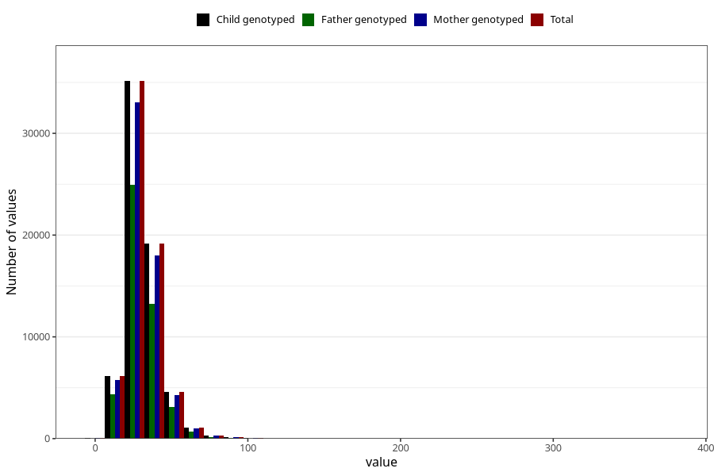

# saturated_fatty_acids
Variable mapping to `METTET` in `Skjema2_beregning_CDW_v12`.
- Number of values:

| Value | Total | Child genotyped | Mother genotyped | Father genotyped |
| ----- | ----- | --------------- | ---------------- | ---------------- |
| Missing | 14322 | 14322 | 13583 | 6707 |
| Non-missing | 66701 | 66701 | 62646 | 46604 |
| 25th percentile | 23.86 | 23.86 | 23.84 | 23.7175 |
| 50th percentile | 29.41 | 29.41 | 29.39 | 29.18 |
| 75th percentile | 36.44 | 36.44 | 36.42 | 36.05 |
| Mean | 31.2864840107345 | 31.2864840107345 | 31.257098298375 | 30.953534889709 |
| Standard deviation | 11.6113466613398 | 11.6113466613398 | 11.5791841015383 | 11.2028969815961 |
| N | 66701 | 66701 | 62646 | 46604 |

