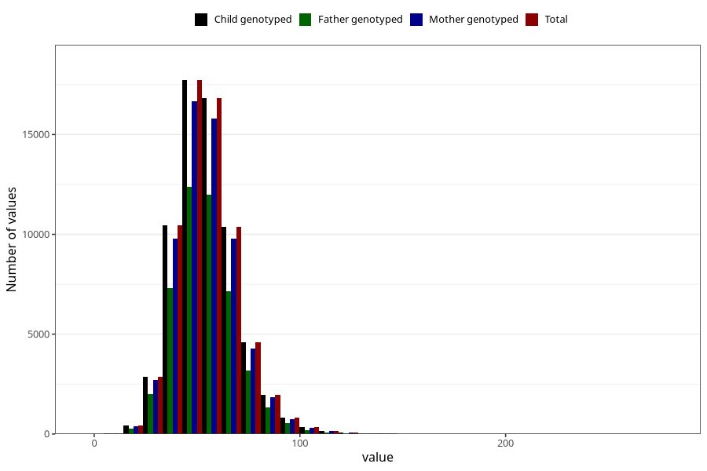

# selenium
Variable mapping to `SELEN` in `Skjema2_beregning_CDW_v12`.
- Number of values:

| Value | Total | Child genotyped | Mother genotyped | Father genotyped |
| ----- | ----- | --------------- | ---------------- | ---------------- |
| Missing | 14322 | 14322 | 13583 | 6707 |
| Non-missing | 66701 | 66701 | 62646 | 46604 |
| 25th percentile | 44.6 | 44.6 | 44.63 | 44.61 |
| 50th percentile | 53.3 | 53.3 | 53.31 | 53.27 |
| 75th percentile | 63.01 | 63.01 | 62.98 | 62.81 |
| Mean | 54.7427329425346 | 54.7427329425346 | 54.7227995402739 | 54.5954109089349 |
| Standard deviation | 15.2559420988681 | 15.2559420988681 | 15.1945176655208 | 14.9529044716 |
| N | 66701 | 66701 | 62646 | 46604 |

