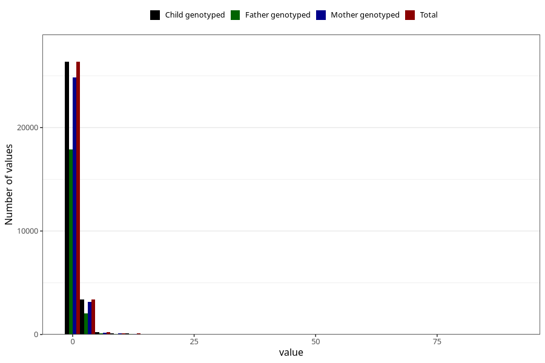

# soda_before
Variable mapping to `AA1395` in `Skjema1_v12`.
- Number of values:

| Value | Total | Child genotyped | Mother genotyped | Father genotyped |
| ----- | ----- | --------------- | ---------------- | ---------------- |
| Missing | 50893 | 50893 | 47852 | 33113 |
| Non-missing | 30130 | 30130 | 28377 | 20198 |
| Consumption have been reported by a mark but no amount given | 4 | 4 | 3 |2 |
| 25th percentile | 0 | 0 | 0 | 0 |
| 50th percentile | 0 | 0 | 0 | 0 |
| 75th percentile | 1 | 1 | 1 | 1 |
| Mean | 0.572063997875589 | 0.572063997875589 | 0.564742369775146 | 0.524707862943157 |
| Standard deviation | 1.40551432160476 | 1.40551432160476 | 1.38910077678276 | 1.38246133588026 |
| N | 30126 | 30126 | 28374 | 20196 |

