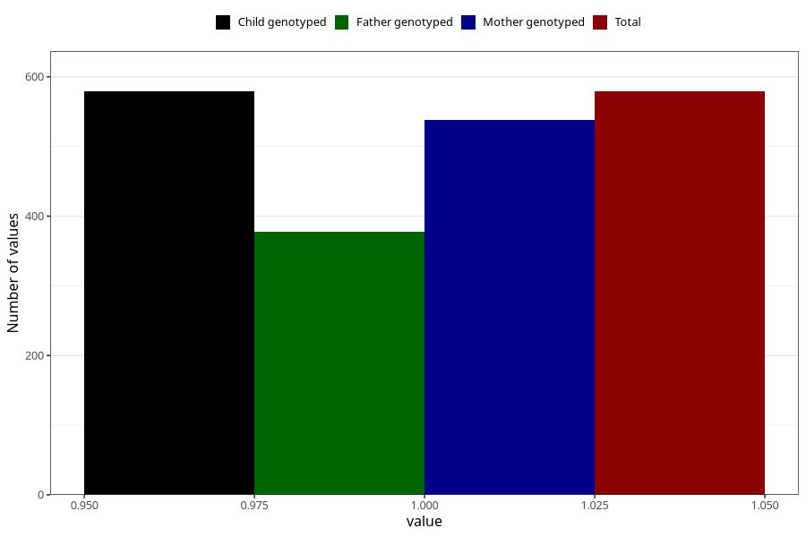

# soda_decaf
Variable mapping to `AA1397` in `Skjema1_v12`.
- Number of values:

| Value | Total | Child genotyped | Mother genotyped | Father genotyped |
| ----- | ----- | --------------- | ---------------- | ---------------- |
| Missing | 80444 | 80444 | 75691 | 52934 |
| Non-missing | 579 | 579 | 538 | 377 |
| 1 | 579 | 579 | 538 | 377 |

