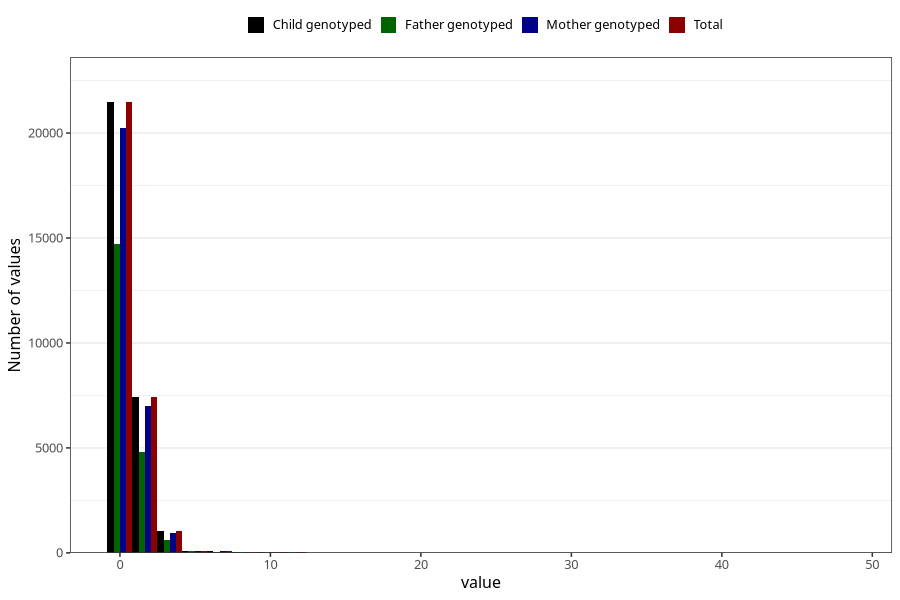

# soda_during
Variable mapping to `AA1396` in `Skjema1_v12`.
- Number of values:

| Value | Total | Child genotyped | Mother genotyped | Father genotyped |
| ----- | ----- | --------------- | ---------------- | ---------------- |
| Missing | 50734 | 50734 | 47683 | 32960 |
| Non-missing | 30289 | 30289 | 28546 | 20351 |
| Consumption have been reported by a mark but no amount given | 3 | 3 | 2 |1 |
| 0 | 21469 | 21469 | 20259 | 14730 |
| 1 | 5473 | 5473 | 5167 | 3546 |
| 2 | 1971 | 1971 | 1837 | 1241 |
| 3 | 216 | 216 | 201 | 120 |
| 4 | 823 | 823 | 765 | 498 |
| 5 | 103 | 103 | 99 | 69 |
| 6 | 81 | 81 | 79 | 54 |
| 7 | 15 | 15 | 15 | 9 |
| 8 | 54 | 54 | 49 | 32 |
| 9 | 5 | 5 | 5 | 5 |
| 10 | 30 | 30 | 26 | 19 |
| 11 | 3 | 3 | 3 | 2 |
| 12 | 36 | 36 | 33 | 21 |
| 14 | 1 | 1 | 1 | 0 |
| 16 | 2 | 2 | 2 | 1 |
| 20 | 1 | 1 | 1 | 1 |
| 28 | 1 | 1 | 0 | 0 |
| 48 | 2 | 2 | 2 | 2 |

