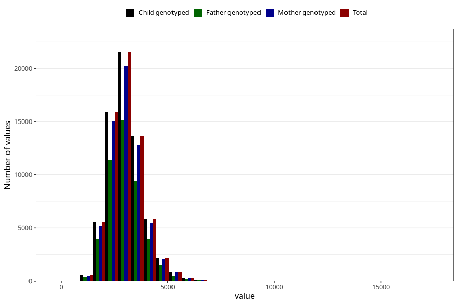

# sodium
Variable mapping to `NATRIUM` in `Skjema2_beregning_CDW_v12`.
- Number of values:

| Value | Total | Child genotyped | Mother genotyped | Father genotyped |
| ----- | ----- | --------------- | ---------------- | ---------------- |
| Missing | 14322 | 14322 | 13583 | 6707 |
| Non-missing | 66701 | 66701 | 62646 | 46604 |
| 25th percentile | 2515.61 | 2515.61 | 2515.8325 | 2509.655 |
| 50th percentile | 2972.11 | 2972.11 | 2971.35 | 2958.18 |
| 75th percentile | 3499.54 | 3499.54 | 3497.7875 | 3475.8875 |
| Mean | 3059.37095725701 | 3059.37095725701 | 3058.03593685151 | 3041.26279375161 |
| Standard deviation | 832.855535162515 | 832.855535162515 | 829.279680780753 | 811.918112169381 |
| N | 66701 | 66701 | 62646 | 46604 |

