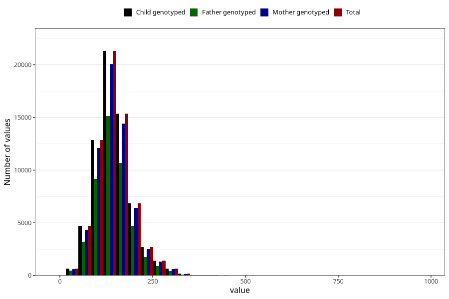

# starch
Variable mapping to `STIVELSE` in `Skjema2_beregning_CDW_v12`.
- Number of values:

| Value | Total | Child genotyped | Mother genotyped | Father genotyped |
| ----- | ----- | --------------- | ---------------- | ---------------- |
| Missing | 14322 | 14322 | 13583 | 6707 |
| Non-missing | 66701 | 66701 | 62646 | 46604 |
| 25th percentile | 114.49 | 114.49 | 114.52 | 114.21 |
| 50th percentile | 140.93 | 140.93 | 140.88 | 140.05 |
| 75th percentile | 170.75 | 170.75 | 170.7 | 169.45 |
| Mean | 145.870926972609 | 145.870926972609 | 145.817408294225 | 144.855078534031 |
| Standard deviation | 49.6506240739461 | 49.6506240739461 | 49.4263825093048 | 48.4221891214958 |
| N | 66701 | 66701 | 62646 | 46604 |

