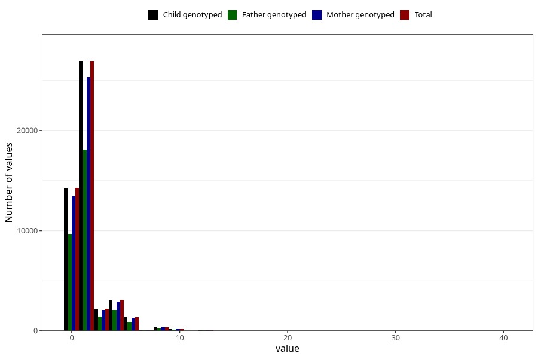

# tea_before
Variable mapping to `AA1386` in `Skjema1_v12`.
- Number of values:

| Value | Total | Child genotyped | Mother genotyped | Father genotyped |
| ----- | ----- | --------------- | ---------------- | ---------------- |
| Missing | 32493 | 32493 | 30511 | 20759 |
| Non-missing | 48530 | 48530 | 45718 | 32552 |
| Consumption have been reported by a mark but no amount given | 6 | 6 | 5 |5 |
| 0 | 14256 | 14256 | 13439 | 9676 |
| 1 | 15164 | 15164 | 14266 | 10249 |
| 2 | 11762 | 11762 | 11081 | 7827 |
| 3 | 2186 | 2186 | 2060 | 1432 |
| 4 | 3111 | 3111 | 2948 | 2070 |
| 5 | 534 | 534 | 498 | 338 |
| 6 | 846 | 846 | 788 | 533 |
| 7 | 50 | 50 | 50 | 31 |
| 8 | 372 | 372 | 348 | 234 |
| 9 | 15 | 15 | 13 | 11 |
| 10 | 152 | 152 | 148 | 96 |
| 12 | 49 | 49 | 47 | 34 |
| 14 | 6 | 6 | 6 | 5 |
| 15 | 4 | 4 | 4 | 3 |
| 16 | 6 | 6 | 6 | 3 |
| 20 | 6 | 6 | 6 | 3 |
| 24 | 3 | 3 | 3 | 1 |
| 30 | 1 | 1 | 1 | 0 |
| 40 | 1 | 1 | 1 | 1 |

