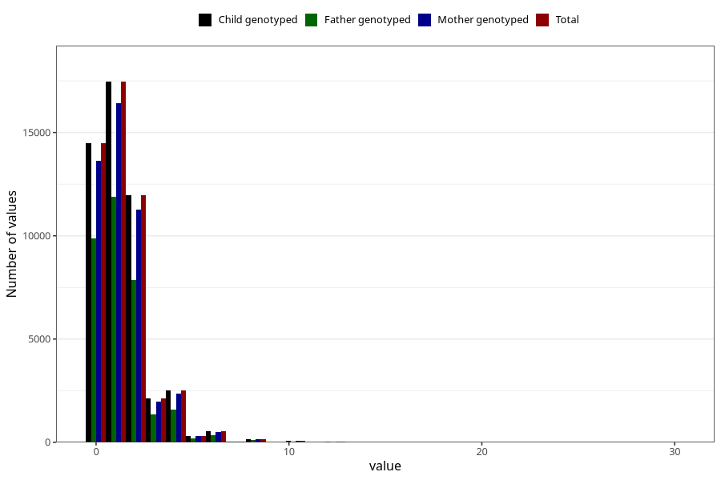

# tea_during
Variable mapping to `AA1387` in `Skjema1_v12`.
- Number of values:

| Value | Total | Child genotyped | Mother genotyped | Father genotyped |
| ----- | ----- | --------------- | ---------------- | ---------------- |
| Missing | 31385 | 31385 | 29450 | 20030 |
| Non-missing | 49638 | 49638 | 46779 | 33281 |
| Consumption have been reported by a mark but no amount given | 7 | 7 | 6 |6 |
| 0 | 14476 | 14476 | 13645 | 9887 |
| 1 | 17458 | 17458 | 16437 | 11872 |
| 2 | 11960 | 11960 | 11270 | 7845 |
| 3 | 2112 | 2112 | 1982 | 1368 |
| 4 | 2495 | 2495 | 2368 | 1591 |
| 5 | 313 | 313 | 296 | 191 |
| 6 | 518 | 518 | 494 | 335 |
| 7 | 34 | 34 | 34 | 24 |
| 8 | 167 | 167 | 157 | 113 |
| 9 | 8 | 8 | 7 | 3 |
| 10 | 59 | 59 | 54 | 28 |
| 11 | 2 | 2 | 2 | 1 |
| 12 | 17 | 17 | 15 | 9 |
| 14 | 3 | 3 | 3 | 3 |
| 15 | 2 | 2 | 2 | 2 |
| 16 | 3 | 3 | 3 | 1 |
| 20 | 3 | 3 | 3 | 2 |
| 30 | 1 | 1 | 1 | 0 |

