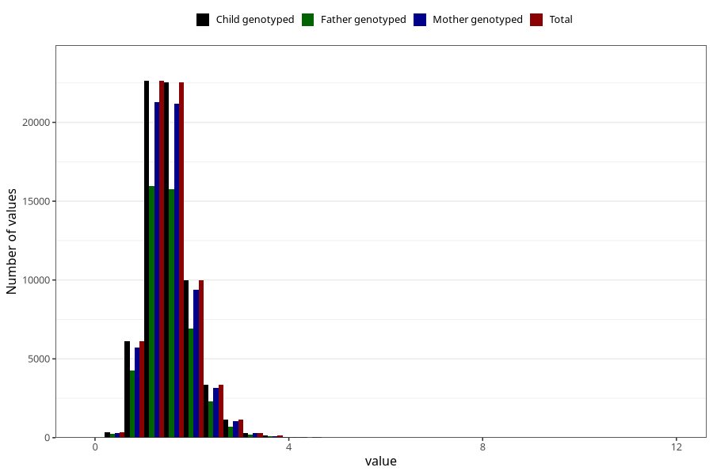

# thiamin
Variable mapping to `TIAMIN` in `Skjema2_beregning_CDW_v12`.
- Number of values:

| Value | Total | Child genotyped | Mother genotyped | Father genotyped |
| ----- | ----- | --------------- | ---------------- | ---------------- |
| Missing | 14322 | 14322 | 13583 | 6707 |
| Non-missing | 66701 | 66701 | 62646 | 46604 |
| 25th percentile | 1.23 | 1.23 | 1.23 | 1.23 |
| 50th percentile | 1.49 | 1.49 | 1.49 | 1.48 |
| 75th percentile | 1.79 | 1.79 | 1.79 | 1.79 |
| Mean | 1.55169967466755 | 1.55169967466755 | 1.55082559141845 | 1.54346837181358 |
| Standard deviation | 0.493757046641048 | 0.493757046641048 | 0.491919205516065 | 0.48064164738579 |
| N | 66701 | 66701 | 62646 | 46604 |

