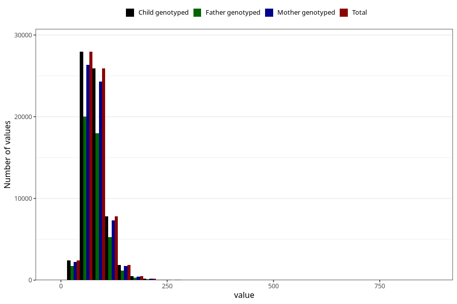

# tot_fat
Variable mapping to `TOT_FETT` in `Skjema2_beregning_CDW_v12`.
- Number of values:

| Value | Total | Child genotyped | Mother genotyped | Father genotyped |
| ----- | ----- | --------------- | ---------------- | ---------------- |
| Missing | 14322 | 14322 | 13583 | 6707 |
| Non-missing | 66701 | 66701 | 62646 | 46604 |
| 25th percentile | 62.99 | 62.99 | 62.95 | 62.59 |
| 50th percentile | 76.82 | 76.82 | 76.79 | 76.21 |
| 75th percentile | 93.88 | 93.88 | 93.81 | 92.96 |
| Mean | 81.105389724292 | 81.105389724292 | 81.0436069342017 | 80.2842691614454 |
| Standard deviation | 28.0317390907643 | 28.0317390907643 | 27.9760257192891 | 27.0437189883525 |
| N | 66701 | 66701 | 62646 | 46604 |

