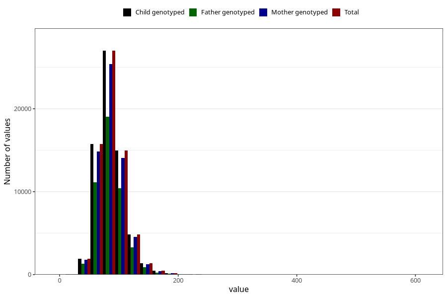

# tot_prot
Variable mapping to `TOT_PROT` in `Skjema2_beregning_CDW_v12`.
- Number of values:

| Value | Total | Child genotyped | Mother genotyped | Father genotyped |
| ----- | ----- | --------------- | ---------------- | ---------------- |
| Missing | 14322 | 14322 | 13583 | 6707 |
| Non-missing | 66701 | 66701 | 62646 | 46604 |
| 25th percentile | 72.17 | 72.17 | 72.1525 | 72.08 |
| 50th percentile | 84.6 | 84.6 | 84.57 | 84.33 |
| 75th percentile | 99.15 | 99.15 | 99.09 | 98.72 |
| Mean | 87.4649940780498 | 87.4649940780498 | 87.4150724707084 | 87.0626727319543 |
| Standard deviation | 23.8016209753519 | 23.8016209753519 | 23.7198141937209 | 23.1677164812007 |
| N | 66701 | 66701 | 62646 | 46604 |

